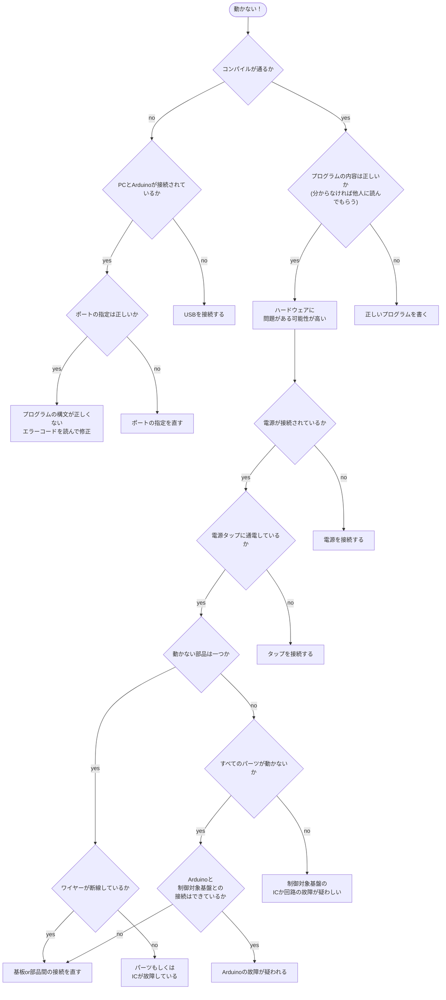
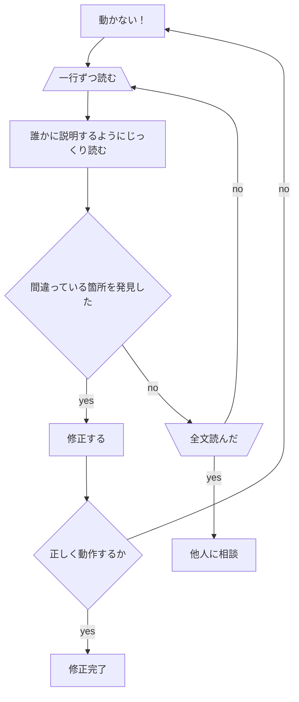

+++
title = "動かないときは"
weight = 4
+++

**エラーコードが出てるときはエラーコードを読む！**

エラーコードは赤色で、英語で、よくわからなくて、怖いかもしれませんが、恐れることはありません  
エラーコードと仲良くなりましょう

このページを読んでも分からないときは、ほかの部員に相談しましょう

## とにかく動かないとき

## プログラムのどこが間違っているかわからないとき

